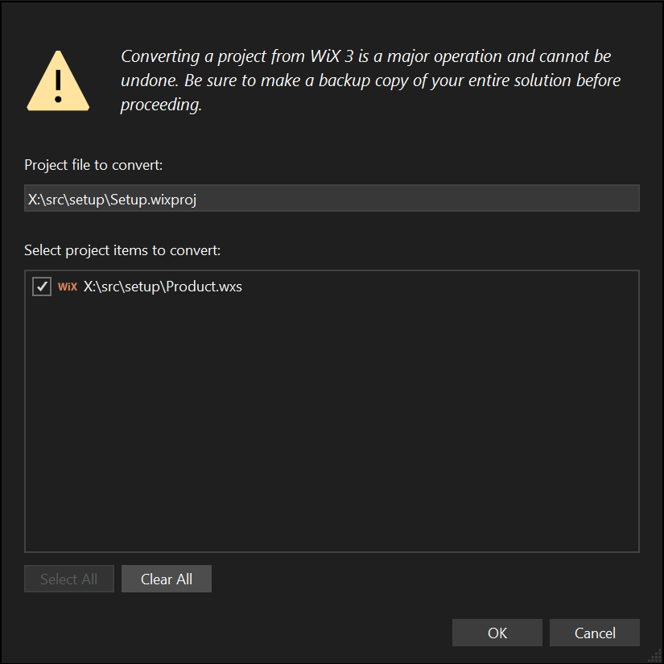

# WiX v4 适用于 WiX v3 用户

WiX 在 v3 和 v4 之间发生了许多变化，但 .wxs 文件的编写基础部分看起来非常相似。这里有一个 [FAQ 讨论了包和捆绑包的变化](./faqs.md)。以下是一些更高级的变化：

- 与 WiX v3 不同，WiX v4 不需要在每台开发机器和构建镜像上进行安装。相反，WiX v4 遵循现代 .NET 模型，通过 NuGet 提供工具。
  - WiX v4 的 MSBuild 项目是 SDK 风格的项目；MSBuild 和 NuGet 一起工作，将 WiX v4 MSBuild SDK NuGet 包下载到项目中。
  - 支持 .NET Framework MSBuild 和 `dotnet build`。
  - 要从命令行构建包，WiX v4 可作为 .NET 工具提供，这也是一个 NuGet 包。
  - WiX 扩展以 NuGet 包的形式提供，可从 MSBuild 项目（通过 `PackageReference`）和 WiX .NET 工具中使用。
- 对于命令行爱好者，大多数可执行文件已合并为一个带有命令的 `wix.exe` 工具。例如，在 WiX v3 中，你可能需要调用 Candle.exe 一次或多次来编译你的创作，然后调用 Light.exe 来链接和绑定编译后的创作到 .msi 包中。而在 WiX v4 中，使用 `wix.exe`，这变成了一个命令：`wix build -o product.msi product.wxs`。

WiX v4 语言有一些简化，并使用了新的命名空间，因此 WiX v3 的创作需要进行转换。幸运的是，有一个工具可以完成这个任务。

## 从命令行转换 WiX 创作

要从命令行将 WiX v3 创作转换为 WiX v4，首先安装 [WiX .NET 工具](intro.md#nettool)。然后可以运行 `wix convert`：

:::tip
默认情况下，`wix convert` 会就地转换文件，覆盖原始文件。你可以添加 `--dry-run` 开关，让 `wix convert` 报告它会进行哪些更改，但不实际执行更改。当然，你安装程序源代码在版本控制中，因此你可以随时轻松恢复 `wix convert` 所做的更改。我是说，它在版本控制中，对吧？！
:::

- 转换单个 WiX 源文件：`wix convert path\to\file.wxs`。
- 转换指定目录中的所有 WiX 源文件：`wix convert path\to\*.wxs`。
- 转换指定目录中的所有 WiX 源文件、包含文件和本地化文件：`wix convert path\to\*.wx?`。
- 转换指定目录树中的所有 WiX 源文件、包含文件和本地化文件：`wix convert --recurse path\to\*.wx?`。

## 从 Visual Studio 转换 WiX 项目和创作

[FireGiant](https://www.firegiant.com/) 的 [HeatWave 社区版][heatwave] 包含对将 WiX v3 创作（如使用 `wix convert`）和将 WiX v3 .wixproj MSBuild 项目转换为 SDK 风格的 WiX v4 项目的支持。

[HeatWave 社区版 免费提供。][heatwave]

[heatwave]: https://www.firegiant.com/wix/heatwave/
